[ProvToolbox](http://lucmoreau.github.io/ProvToolbox/) is a useful command line tool for [validating and visualizing](../validating-and-visualising-prov/) PROV documents, but unfortunately it can be a bit of a challenge to [install on Windows](../installing-provtoolbox-in-windows/) and on **macOS** because of its dependency requirements.

This post suggests three step-by-step methods of installing ProvToolbox on your Mac – you should follow the method you feel most comfortable with, but can try the other methods in case of problems.

### Table of content

1.  [Overview of requirements](#requirements)
    1.  [Software packaging for macOS](#packaging)
2.  [Conda](#conda)
    1.  [Installing Graphviz and OpenJDK with Conda](#graphviz-openjdk-conda)
3.  [HomeBrew](#homebrew)
    1.  [Installing Graphviz with HomeBrew](#graphviz-homebrew)
    2.  [Installing OpenJDK with HomeBrew](#openjdk-homebrew)
4.  [Installing manually](#manual-install)
    1.  [Installing AdoptOpenJDK manually](#adoptopenjdk)
    2.  [Installing Graphviz manually](#graphviz)
5.  [Installing ProvToolbox](#provtoolbox)
    1.  [Using ProvToolbox from VSCode](#vscode)

Overview of requirements
------------------------

As of 2020-08, ProvToolbox 0.9.5 is the latest [release](https://github.com/lucmoreau/ProvToolbox/wiki/Releases), which requires:

*   Java JRE 9 or later. We'll show how to install OpenJDK 11 which is the closest _Long-Term Support_ release.
*   [Graphviz](https://graphviz.org/download/#mac) 2.x (for visualization)

There is also an outdated [installer of ProvToolbox for macOS](https://github.com/lucmoreau/ProvToolbox/wiki/Installation#33-macos-x-installer), which is currently **not recommended**. In this guide we'll show how to install ProvToolbox 0.9.5 from ZIP along with its requirements.

**Warning:** This guide has been developed for **Intel-based Macs**, if you are using the new ARM64 Mac you will either need to use compatibility modes or install/compile these individual dependencies manually.

### Software packaging for macOS

Traditionally software installations on macOS are either drag-drop _Application_ bundles (as from the Mac App Store or _dmg_ disk images) or the wizard-based _pkg_ installation packages, which can modify the Operating System.

Both of these approaches require the software to bundle all its dependencies, or that the user carefully install matching dependencies in order. As many open source software packages, particularly for the command line and programming, rely heavily on other software libraries, this traditional approach can become cumbersome or fragile over time.

As an alternative, several software packaging initiatives have evolved that work with macOS, including:

*   [Conda](https://docs.conda.io/en/latest/)  
    Initially centered around supporting multiple Python binaries and Jupyter Notebook, the [Anaconda](https://anaconda.org/) repository provides a large selection of pre-compiled open source software tools and libraries, particularly for data science and academic users. Also available for Windows and Linux. Conda can activate different _environments_ which is useful for reproducibility or if installing multiple versions of the same software.
*   [HomeBrew](https://brew.sh/)  
    A recipe-based repository of pre-compiled software, including most general-purpose open source you will want to install in macOS, but also useful for adding newer versions of software already installed in macOS. Usually fast and straight forward to use as long as HomeBrew itself installs correctly, and packages are kept up to date.
*   [MacPorts](https://www.macports.org/)  
    Similar to HomeBrew, providing a large selection of general open source packages. Compiles from source code locally, which can be time-consuming and requires installation of build tools like XCode. Useful for experimenting with _bleeding edge_ versions of software.

These systems work similar to _Linux distributions_ like Ubuntu or Debian, in that installing a particular package will also install its dependencies. However the packages and binaries are installed under a dedicated folder, typically under `/usr/local` or `/Users/alice/miniconda3` within the user home directory. This _alternative root_ will have traditional POSIX folders corresponding to their operating system counter-parts under `/usr` like `bin/` `lib/` and `share/` — allowing the package system to rely on runtimes like Python, independent of what Apple may provide in that particular macOS version.

These packaging systems therefore typically modify the system variable `PATH` _for the current user_, so that the tools installed can _take preference_ over the commands included with the operating system.

**Note:** You should **not** need to use `sudo` to install software within the chosen packaging system.

**Warning**: If you are already using programming languages like Java, Python or Ruby, be aware that after installing a packaging system according to this guide, your `PATH` may pick up a different version of runtimes/compilers, which may require you to reinstall any additional libraries you use. To check which path is resolved, use the shell built-in `**type**`:

```
$ type python
python is /home/stain/miniconda3/bin/python
```

Conda
-----

We found that using the package manager Conda gave the most consistent results for installing the dependencies of ProvToolbox. The large selection of packages in [Anaconda repository](https://anaconda.org/) is also useful for data science purposes, such as using Jupyter Notebook or R.

While there are multiple ways to [install Conda on macOS](https://docs.conda.io/projects/conda/en/latest/user-guide/install/macos.html), we here show the [Miniconda](https://conda.io/en/latest/miniconda.html) method using the Terminal.

First open the **Terminal** application from **Applications/Utilities**:


To install Miniconda, run these two commands:

```
curl -O https://repo.anaconda.com/miniconda/Miniconda3-latest-MacOSX-x86_64.sh

sh Miniconda3-latest-MacOSX-x86_64.sh 
```

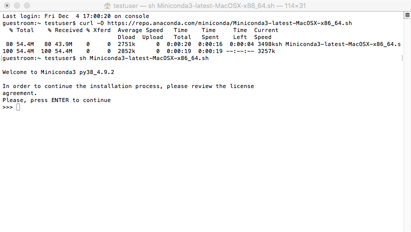

As installation finishes, ensure you say **yes** to allow `conda init` to modify your `PATH`.

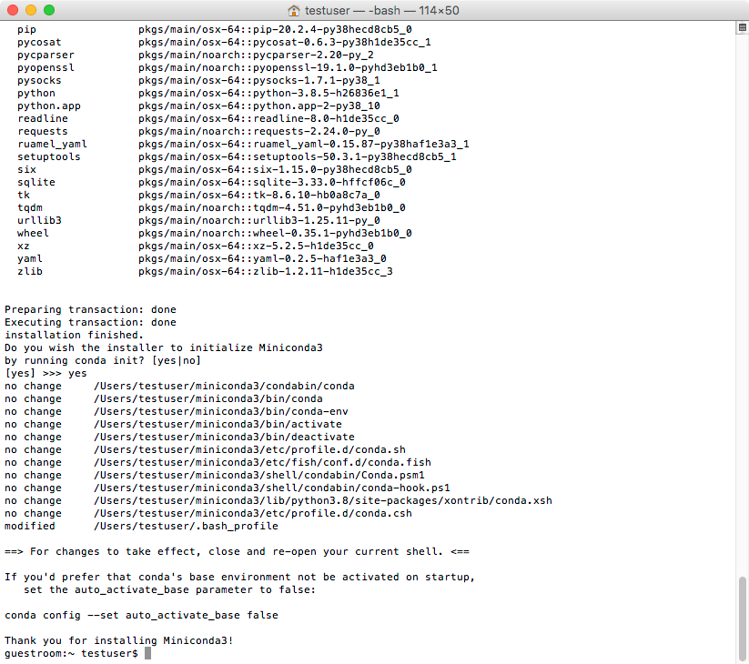

Here the Conda _base environment_ have been installed under `/Users/testuser/miniconda3` however we need to start a new terminal to _activate_ it.

**Note:** If you are on macOS Catalina or newer, the default shell is now _zsh_. Substituting `testuser` below you may need to run the equivalent of:

```
source $HOME/miniconda/bin/activate 
conda init zsh
```

### Installing Graphviz and OpenJDK with Conda

First, in a **new terminal window**, check that the `conda` command is working by searching for Graphviz:

```
conda search graphviz
```

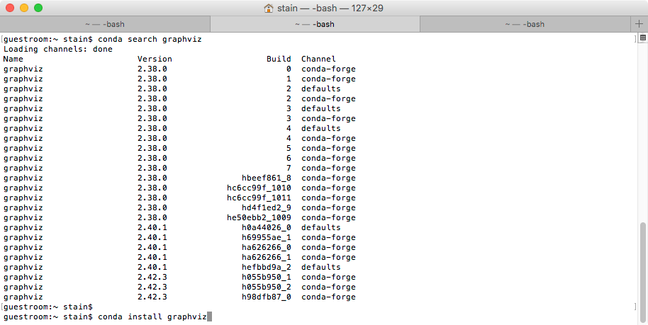

We can install graphviz and OpenJDK 11 at the same time using:

```
conda install graphviz openjdk=11
```

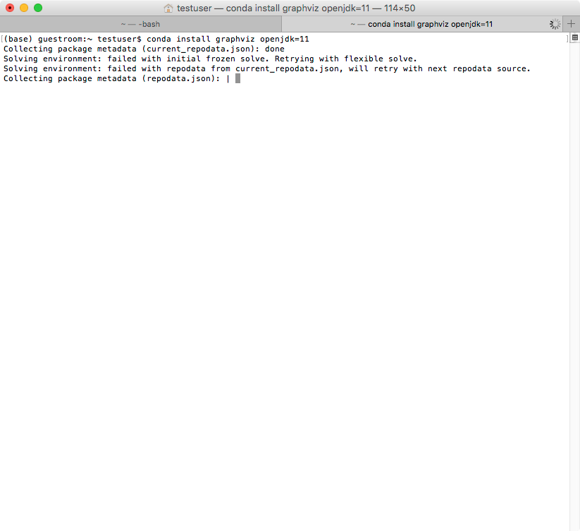

After Conda has resolved dependencies, answer **y** to install:

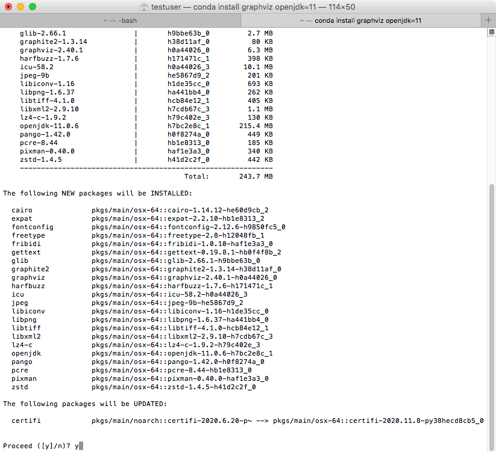

After download and installation has finished, verify both GraphViz and Java work:

```
dot -V
java -version
```

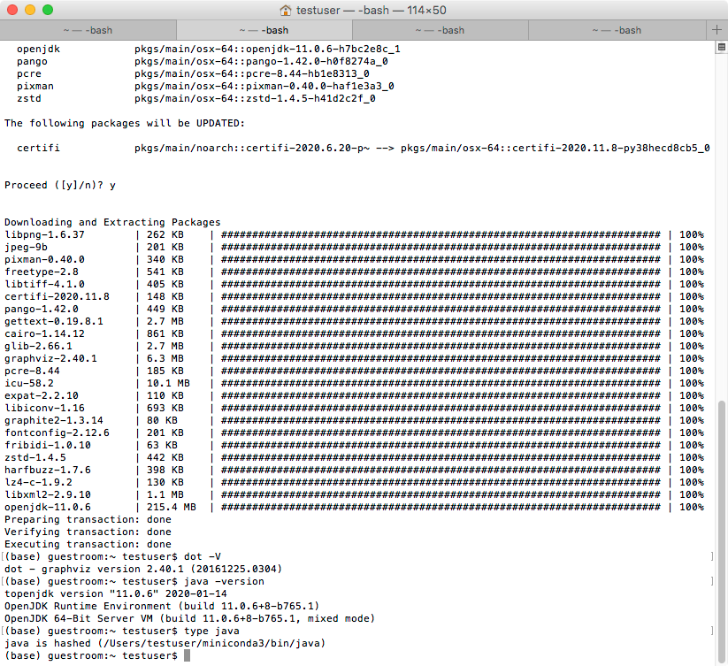

You can now skip to the section on **installing ProvToolbox**.

HomeBrew
--------

[HomeBrew](https://brew.sh/) is a popular package management system for macOS that can help with installing pre-built open source software. However, installing and using HomeBrew itself is not always trivial. This section is provided as an **alternative to the Conda method** above.

**Warning:** In our testing we found HomeBrew **did not work** using an older macOS 10.11. If you are using the newest macOS version on compatible hardware, you are free to try this approach, which can be useful later as HomeBrew adds a convenient way to install many other data science tools in recent versions, e.g. R, LaTeX, Snakemake.

### Installing HomeBrew

First open the **Terminal** application, found under **Applications/Utilities**.


Following the instructions on the [HomeBrew home page](https://brew.sh/), paste this command line _on a single line_ to start installing, providing your user password for administrator rights:

```
/bin/bash -c "$(curl -fsSL https://raw.githubusercontent.com/Homebrew/install/HEAD/install.sh)"
```

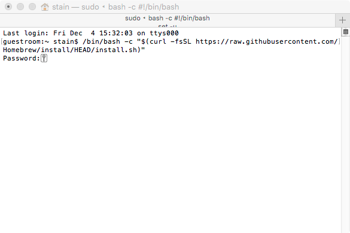

The defaults for installing are usually fine:

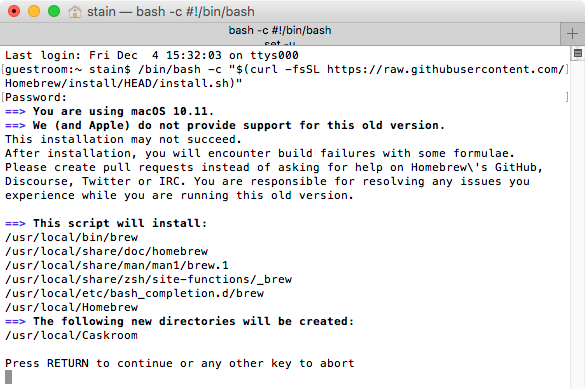

**Note:** If you get a similar warning about **old macOS version**, using HomeBrew may not work well on your machine (as we found in our testing). Try instead the **Conda** method described above.

After installing HomeBrew you may get a warning about _shallow clone_, this can be ignored unless you are developing your own brew recipes.

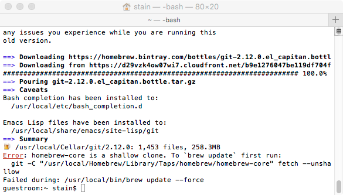

### Installing GraphViz with Homebrew

To activate brew it should be sufficient to start a new Terminal window. Test this by doing running:

```
brew search graphviz
```

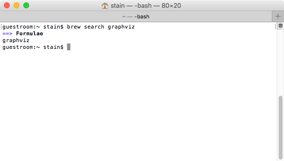

In this case you are ready to install:

```
brew install graphviz
```

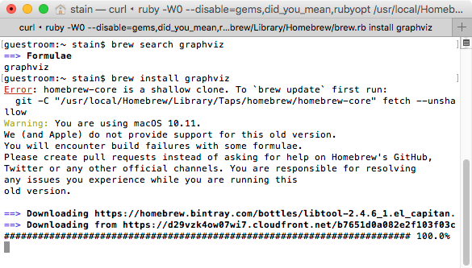

On a good day the above should complete and you would be able to verify the installation of graphviz:

```
dot -V
```

However on our test machine we got a stack trace error indicating a bug in Homebrew itself. This is why this method of Homebrew is not recommended for older Macs.

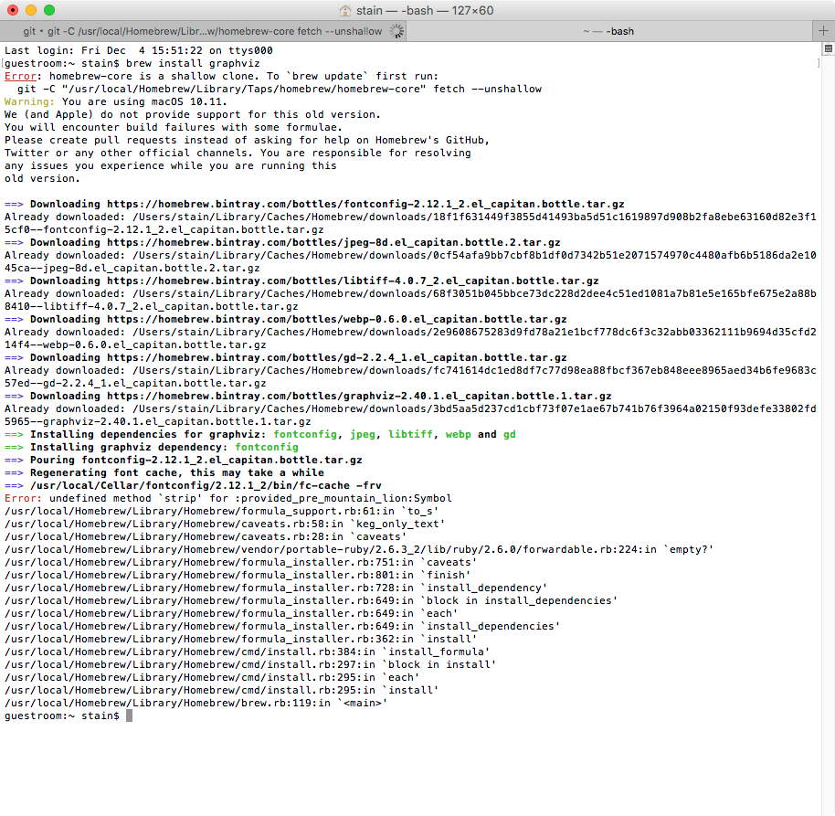

### Installing OpenJDK with HomeBrew

**Warning**: This section has not been tested.

[AdoptOpenJDK](https://adoptopenjdk.net/) is a community effort for packaging binary installers/packages of the open source Java implementation OpenJDK, avoiding restrictive licenses and registration requirements.

To install OpenJDK 11 from [AdoptOpenJDK with HomeBrew](https://github.com/AdoptOpenJDK/homebrew-openjdk) try:

```
brew tap AdoptOpenJDK/openjdk

brew install openjdk
```

Verify the Java version:

```
java -version
```


Iain Emsley [recommends](https://austgate.co.uk/2021/06/installing-and-using-provconvert-on-osx/) to additionally add this symlink (if it does not already point to a different JDK) so that the Java application wrappers on MacOS know where to look. Note that depending on your Homebrew install you may need to replace `/usr/local/opt` with `/opt/openjdk` (see output from `brew install`):

`sudo ln -sfn /usr/local/opt/openjdk/libexec/openjdk.jdk /Library/Java/JavaVirtualMachines/openjdk.jdk`

If both Graphviz and Java are working, you can now skip to the section on **installing ProvToolbox**.

Installing manually
-------------------

### Installing AdoptOpenJDK manually

[AdoptOpenJDK](https://adoptopenjdk.net/) is a community effort for packaging binary installers/packages of the open source Java implementation OpenJDK, avoiding restrictive licenses and registration requirements.

While using a packaging system can help you keep your OpenJDK install updated, if you were unable to use Conda or HomeBrew to install Java, as an **fallback** it is also possible to download the standalone AdoptOpenJDK installer.

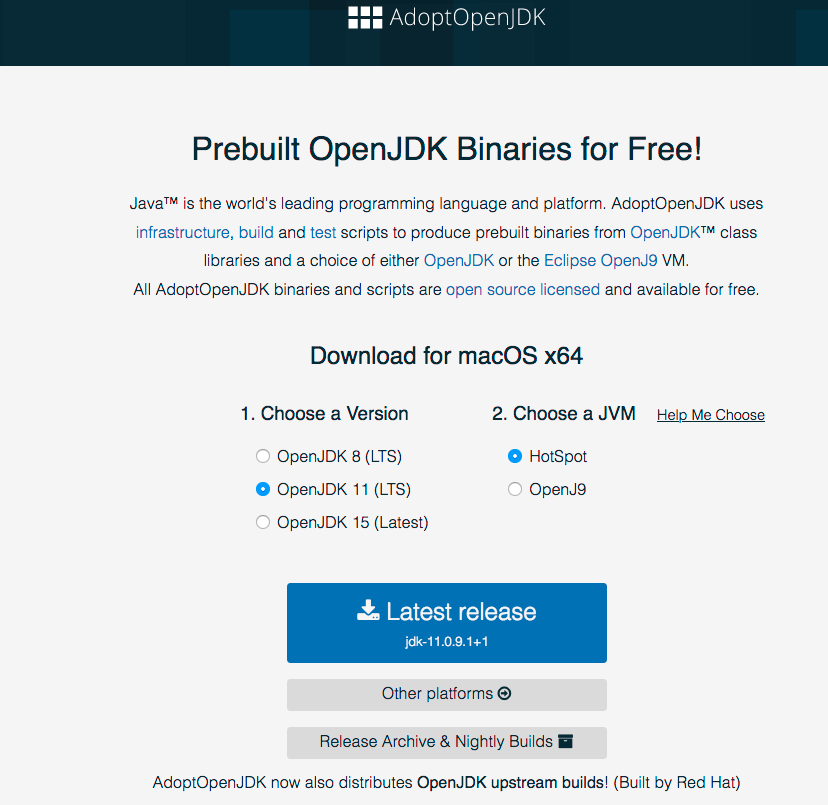

From the [AdoptOpenJDK](https://adoptopenjdk.net/) make sure you select:

*   Version: **Open JDK 11** (LTS)
*   JVM: **HotSpot**
*   OS: **macOS**
*   Architecture: **x64**

If these options are not available, select them from the **[Other Platforms](https://adoptopenjdk.net/releases.html)** page. Download the **pkg** installer of the **JRE**.

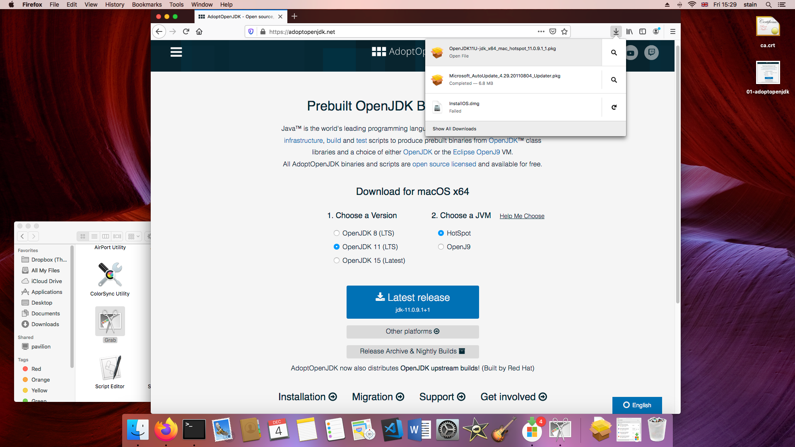

Walk through the installer and use the default settings.

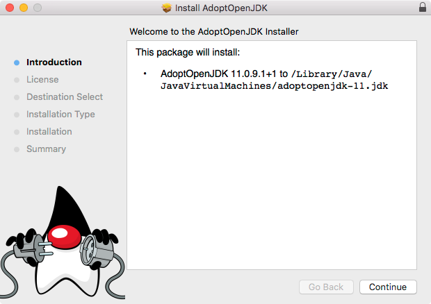

Now open a _new_ **Terminal** from **Applications/Utilities**


The installer should have adjusted your `PATH`. To check the installed version, run:

```
java -version
```

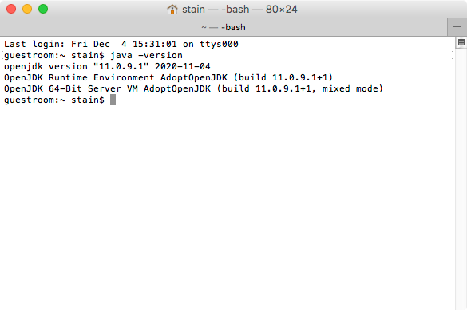

If you don't get the correct Java version you will need to adjust your `PATH` and/or `JAVA_HOME` environmental variables.

### Installing Graphviz manually

Compiling and installing [Graphviz](https://graphviz.org/) from source code is a non-trivial task on macOS. Some outdated [pkg installers of Graphviz](http://www.ryandesign.com/graphviz/) have been made but we have not tested these. A recent blog post details how [graphviz can be compiled using brew dependencies](https://medium.com/@scrossoracle/building-graphviz-from-source-on-macos-b6a846d73949), but this should only be needed for PDF support compared to `brew install graphviz` described above. If you already use [MacPorts](https://www.macports.org/) then try `sudo port install graphviz`

Installing ProvToolbox
----------------------

Following the [ProvToolbox install instructions for "Other Platforms"](https://github.com/lucmoreau/ProvToolbox/wiki/Installation#34-other-platforms), download the [provconvert-0.9.5-release.zip](https://repo1.maven.org/maven2/org/openprovenance/prov/provconvert/0.9.5/provconvert-0.9.5-release.zip):


Opening with **Archive Utility** will unzip to your `Downloads` directory. From there, move the `ProvToolbox` directory to your `**Applications**` folder:

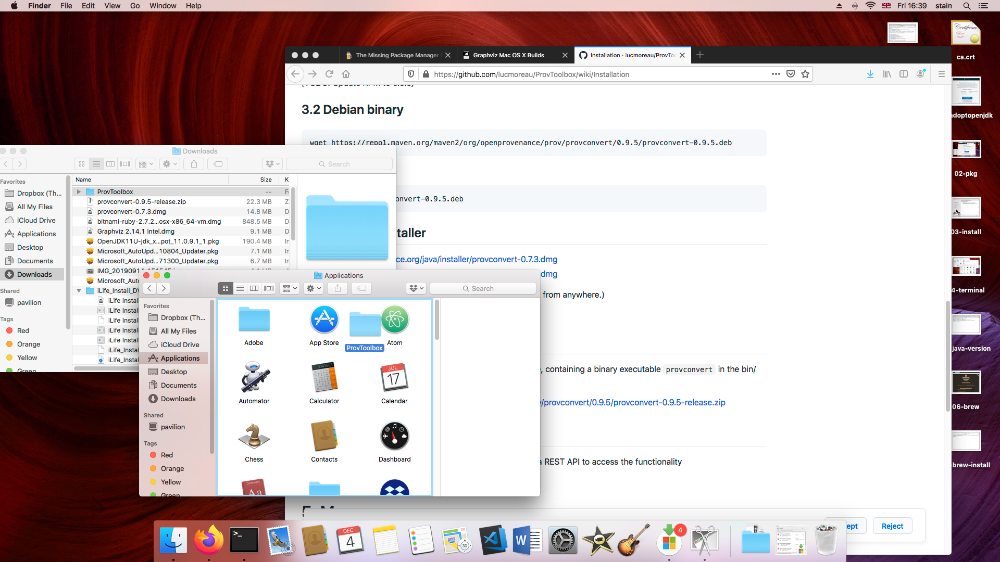

Next we will add the `provconvert` command line to your `PATH`. First open the **Terminal** from **Applications/Utilities**:


Become the **root** user and carefully run:

```
sudo -i

cd /etc/paths.d/

echo /Applications/ProvToolbox/bin > ProvToolbox

exit
```

**Tip:** You can use the **Tab** button to auto-complete the paths.

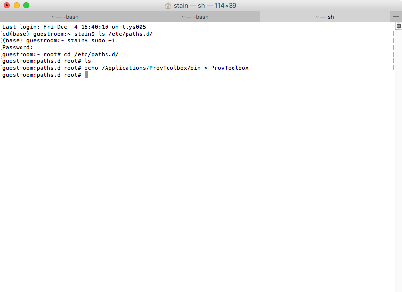

To activate the new PATH, either **restart Terminal** or **log out** of macOS and in again. Now verify with:

```
provconvert -version
```

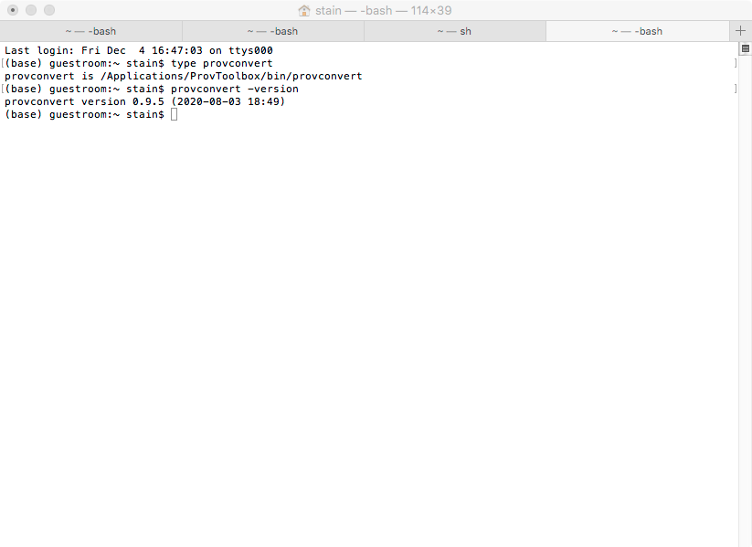

You can now start [validating and visualizing](../validating-and-visualising-prov/) PROV-N with ProvToolbox.

**Tip:** Convert to **png** and use the `**open**` command to preview the diagram:

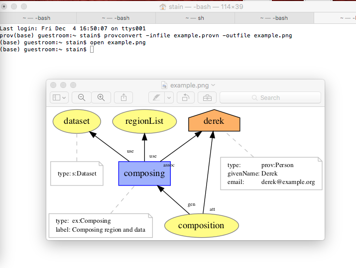

You can use the commands `**cd**` and `**ls**` to **c**hange **d**irectory and **l**i**s**t directories in the Terminal. If you are unfamiliar with navigating the shell, you may find it easiest to save the provn files directly in your home directory.

### Using ProvToolbox from VSCode

While you may use an editor like **Application/Utilities/TextEdit** bundled with macOS for creating PROVN files, you may find an editor like [VSCode](https://code.visualstudio.com/download) more convenient, particularly as it allows opening an [embedded terminal](https://code.visualstudio.com/docs/editor/integrated-terminal). After installing, try **View -> Terminal** in the menu.

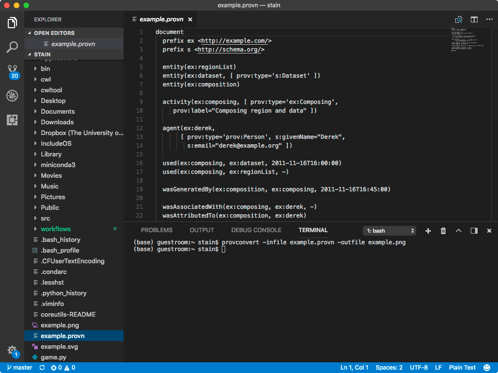

If you convert to **png** you can preview the diagram within VSCode:

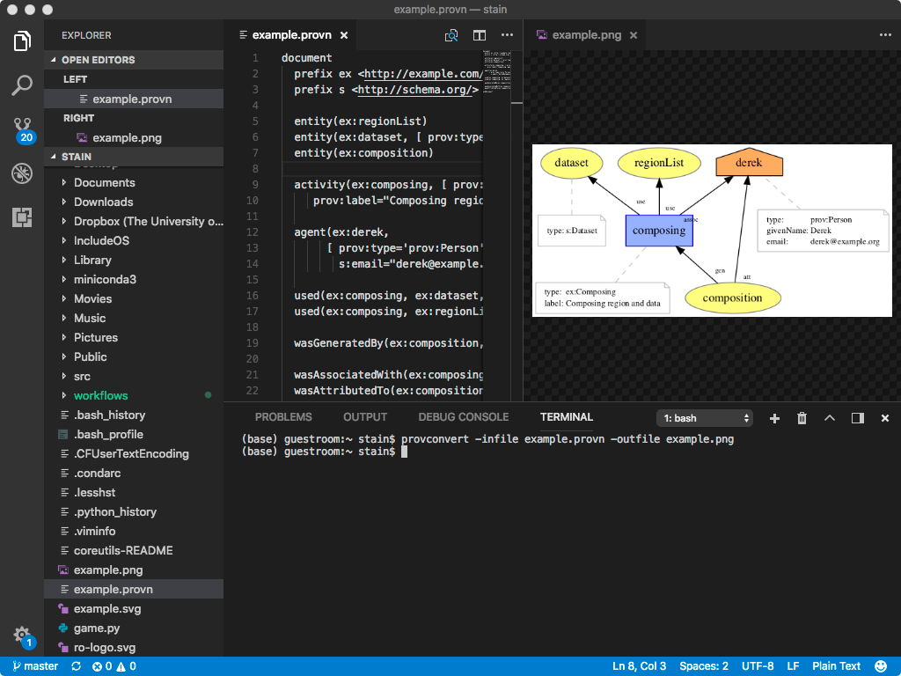