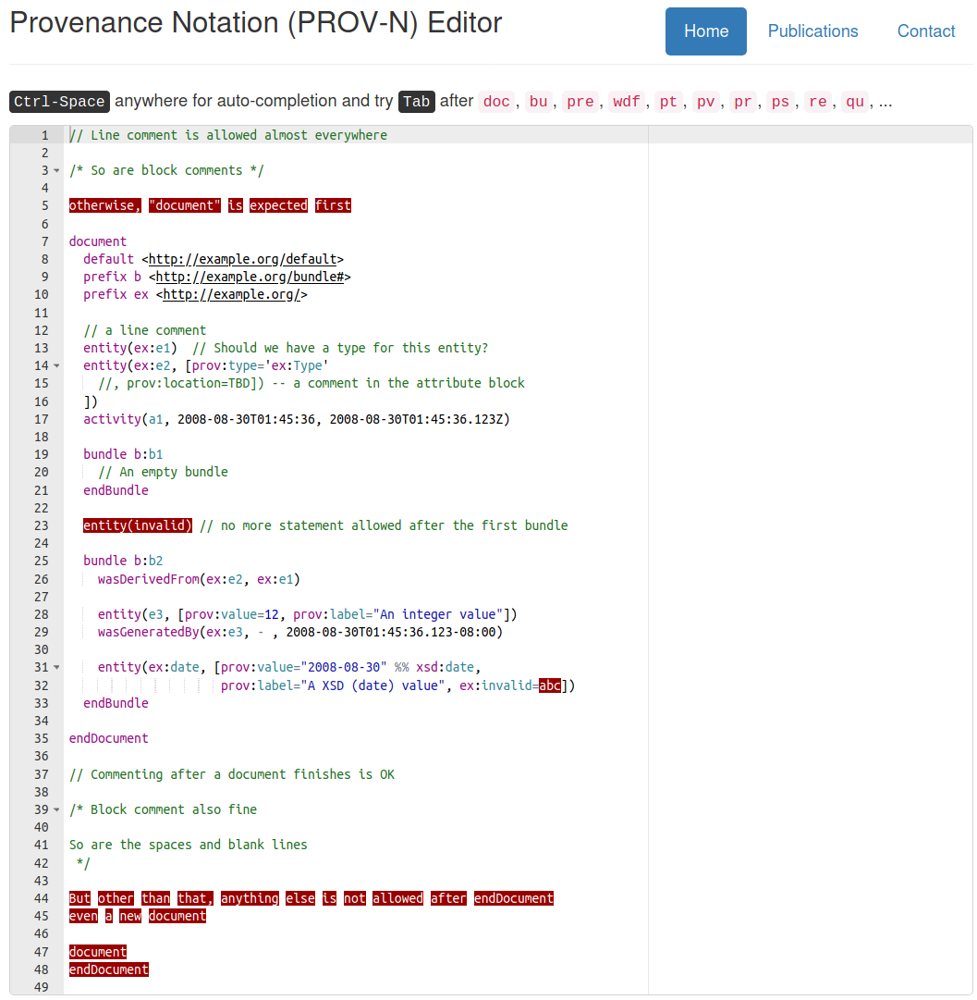
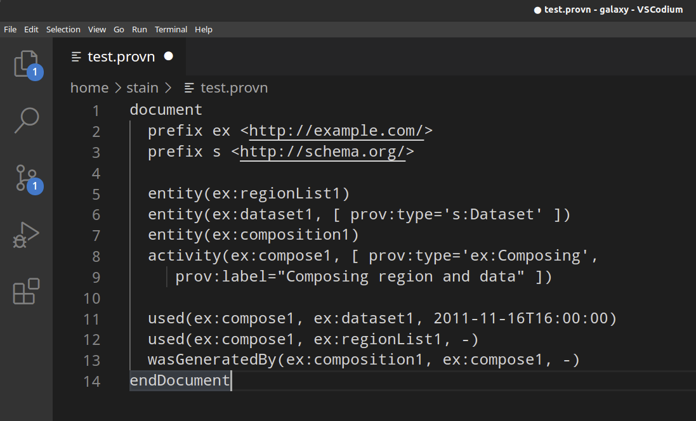
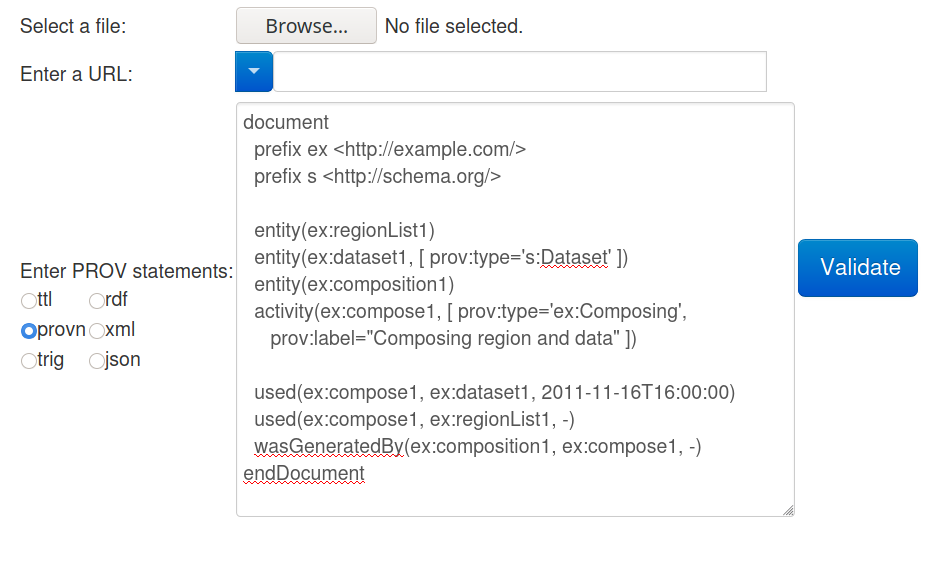
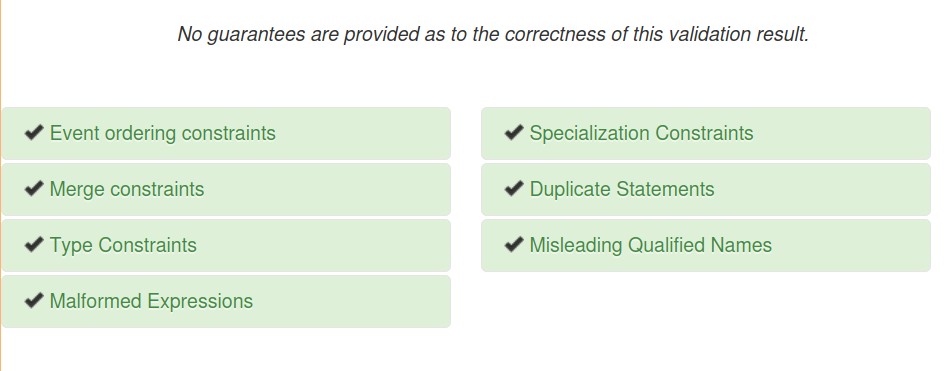

This blog post gives a gentle PROV-N introdction and then explores tools for validating and visualising PROV.

One of the advantages of [W3C PROV](https://www.w3.org/TR/prov-overview/) having a common **data model** is that it can be _serialized_, or written out, in multiple file formats. The PROV family of W3C specifications describe mappings [PROV-XML](http://www.w3.org/TR/prov-xml/) and [PROV-O](http://www.w3.org/TR/prov-o/) (which, being based on [OWL2](http://www.w3.org/TR/owl2-overview/) itself has multiple serializations, for Linked Data including [RDF](https://www.w3.org/TR/rdf11-primer/) formats [Turtle](http://www.w3.org/TR/owl2-overview/) and [JSON-LD](https://www.w3.org/TR/json-ld11/).

In addition to these standard approaches we also have [PROV-JSON](http://www.w3.org/Submission/prov-json/) and [PROV-JSONLD](https://openprovenance.org/prov-jsonld/) which could be well-suited for Web applications. All of these can in theory be mapped to each-other through the common [PROV Data Model](https://www.w3.org/TR/prov-dm/) and the use of [URIs](https://tools.ietf.org/html/rfc3986) as Linked Data global identifiers.

PROV-N
------

PROV also specifies its own language, [PROV-N](https://www.w3.org/TR/prov-n/), a text-based file format that most closely represent the [PROV Data Model](https://www.w3.org/TR/prov-dm/). This representation is used by the [PROV Primer](https://www.w3.org/TR/prov-primer/) to explain the PROV types (`entity`/`agent`/`activity`) and their relationships (e.g. `wasAttributedTo`). For [example](https://gist.github.com/stain/18113538dac002ebebc97a238e57e296):

```
document
  prefix ex <http://example.com/>
  prefix s <http://schema.org/>
  
  entity(ex:regionList)
  entity(ex:dataset, \[ prov:type='s:Dataset' \])
  entity(ex:composition)
  
  activity(ex:composing, \[ prov:type='ex:Composing', 
     prov:label="Composing region and data" \])

  agent(ex:derek,
       \[ prov:type='prov:Person', s:givenName="Derek", 
         s:email="derek@example.org" \])

  used(ex:composing, ex:dataset, 2011-11-16T16:00:00)
  used(ex:composing, ex:regionList, -)
  
  wasGeneratedBy(ex:composition, ex:composing,
                 2011-11-16T16:45:00)
  
  wasAssociatedWith(ex:composing, ex:derek, -)
  wasAttributedTo(ex:composition, ex:derek)

endDocument
```

The above PROV-N can be rendered as a diagram:


Let's go through the PROV-N line by line:

*   `prefix` maps `ex` to the URI _namespace_ starting with `http://example.com/`
    *   PROV identifiers like `ex:dataset1` can be expanded to a Linked Data global identifier `http://example.com/dataset1` (which in an ideal world would _describe_ or perhaps let you _download_ the dataset)
    *   External vocabularies like [schema.org](http://schema.org/) can be reused, e.g. the property `'s:givenName'` expands with the prefix `s:` to form the URI [http://schema.org/givenName](http://schema.org/givenName)
    *   `**prefix** prov <http://www.w3.org/ns/prov#>` is implicit, and is the internal namespace for PROV types and attributes.
    *   **Tip**: It is possible to declare `**default** <http://example.com/>` after which `ex:regionList` can be shortened to `regionList`, however it is recommended to always use explicit prefixes to ease reuse and combination of PROV-N files.
*   `**entity**(ex:regionList)` declares the existence of an entity with that identifier. It can thereafter be used in relationships expecting an entity.
*   The entity `ex:dataset` is similarly declared, but also assigning a more specific _type_, using `http://schema.org/Dataset` from the external vocabulary.
*   The **activity** `ex:composition` is typed using an ad-hoc type `ex:Composing` from our own namespace, but also adds a string _attribute_ to give a more descriptive label.
*   The **agent** identified as `ex:derek` is described with attributes from [schema.org/Person](http://schema.org/Person)
    *   Agents can alternatively have type `prov:Organization` (best described using [schema.org/Organization](http://schema.org/Organization)) or `prov:SoftwareAgent` (described using [schema.org/SoftwareApplication](https://schema.org/SoftwareApplication) or [schema.org/SoftwareSourceCode](https://schema.org/SoftwareSourceCode))
*   Relationships like `**used**` goes backwards in time
    *   The activity `ex:composing` _used_ the pre-exsting entity `ex:dataset`.
    *   The usage happened on 16 Nov 2011 at 16:00 (given in [ISO8601 date-time format](https://www.w3.org/TR/NOTE-datetime))
*   The second `use`, this time of `ex:regionList`, has a placeholder `-` indicating that the required PROV-N argument for date-time is unknown.
*   The relationship `**wasGeneratedBy**` also points backwards in time, the new entity `ex:composition` was generated by the activity `ex:composing` some time later, at 16:45.
*   `**wasAssociatedWith**` indicates that our agent Derek took part in the `ex:composing` activity, with placeholder - as we don't know when.
*   `**wasAttributedTo**` says Derek was (at least partially) invovled in generating the composition.

Some subtleties about PROV-N worth mentioning:

*   Like other Linked Data representations, PROV has an [open world assumption](https://en.wikipedia.org/wiki/Open-world_assumption), meaning that statements given may be a _partial_ description of the actual provenance.
    *   Additional statements carrying new knowledge can always be added, as long as they don't break semantic constraints.
*   Statements can be listed in any order
    *   It is convention to use a chronological partial order old…new so that the last lines in PROV represent the newest events.
*   Entities, Agents and Activities should be **explicitly declared** as such.
    
    *   By convention declarations can be grouped together towards the top (as in above example)
    
    *   Alternatively, a declaration can be listed just before the first reference to its identifier in other statements.
    *   If a relationship is not showing up in PROV visualization, ensure it has the correct declaration.
*   Identifiers are globally unique according to the prefix mapping to URI namespaces.
    *   Use of `http://example.com/` namespaces is legal for examples/prototypes/training, but is at danger of collision if PROV graphs are combined.
    *   To encourage Linked Data, as a minimum use a namespace leading to a human readable page, appending `#`
    *   For instance PROV entities described within this blog post could use:```
        prefix pp <https://practicalprovenance.wordpress.com/2020/11/13/validating-and-visualising-prov/#>
        ```
*   An _entity_ can't concurrently be an _activity_.
    *   However an _agent_ **could** concurrently be an _entity_ **or** an _activity_

Two immediate questions arise when faced with this "new" syntax and language for provenance:

1.  How can we validate its syntax and the correct use of PROV types and arguments to PROV relations?
2.  How can we convert from/to PROV-N and file formats that are more accessible programmatically, such as PROV-JSONLD or PROV-O in Turtle?

PROV tooling
------------

KCL's [openprovenance.org](https://openprovenance.org/#pills-tools) lists PROV supporting tools and libraries, including: [ProvToolbox](https://github.com/lucmoreau/ProvToolbox) (Java), [Prov Python](http://pypi.python.org/pypi/prov), [ProvJS](https://bitbucket.org/provenance/provjs). These libraries can be used by developers for generating or consuming PROV from within a programmatic environment like [Jupyter Notebook](https://jupyter.org/) or a data management application.

In addition there are graphical tools for PROV editing, validation, conversion and visualization described below:

### PROV-N editor

The [PROV-N Editor](https://openprovenance.org/tools/editor/) is an online text editor that provides syntax highlighting and autocomplete for PROV-N, and is useful for beginners new to PROV-N.



Screenshot of [https://openprovenance.org/tools/editor/](https://openprovenance.org/tools/editor/) as of 2020-11-13

Note that the starting example PROV-N aims to be somewhat complete, including the advanced use of nested `bundle .…. endBundle` block, `//comments` and deliberate invalid statements (shown in red).

We recommend using the [PROV-N Editor](https://openprovenance.org/tools/editor/) starting with a [simpler example](https://gist.github.com/stain/18113538dac002ebebc97a238e57e296), and to use **copy-paste** to save the PROV-N locally to a file, using a text editor like [Visual Studio Code](https://code.visualstudio.com/) (which unfortunately do not have syntax highlighting for PROV-N):

[](https://vscodium.com/)

PROV-N example from above edited in VSCodium

**Note:** The file extension for PROVN is `.provn`, but you may use `.provn.txt` to ensure it opens in a text editor. Do **not** edit PROV-N in a _text processor_ like Microsoft Word, as its binary format `.docx` (actually a structured ZIP archive of XML files) is not parseable by PROV tools; in addition text processors may provide unhelpful assistance such as changing "quotes" to “curly quotes” which are not part of PROV-N syntax.

### Validating PROV

Although the PROV-N editor does syntax highlighting and can detect glaring mistakes such as invalid file comments, it does not do deeper inspection to detect mistakes such as missing commas, mismatches parentheses, wrong or missing argument to PROV relations. You may also accidentally have added logically inconsistent statements, such as:

```
document
  prefix ex <http://example.com/back-to-the-future/>
  
  entity(ex:results)
  entity(ex:data)
  entity(ex:interviews)

  wasDerivedFrom(ex:results, ex:data)
  wasDerivedFrom(ex:data, ex:interviews)
  wasDerivedFrom(ex:interviews, ex:results)
endDocument
```

While the above "scruffy" PROV-N file is syntactically valid, and each of the statements are OK semantically, as a whole we seem to have added a semantic violation of causality; an [entity can't be generated from entities not yet existing](https://www.w3.org/TR/prov-constraints/#entity-constraints). An attempt to draw the above as a diagram will show an endless loop of derivations:

 <!-- FIXME: 403 Forbidden -->

To ensure your PROV-N is both syntactically valid and semantically consistent, it is best to use a PROV **validator**.

#### PROV Validator

The [openprovenance.org PROV validator](https://openprovenance.org/services/view/validator) can support PROV-N; remember to tick the correct syntax, specially when pasting rather than uploading a file with the correct extension.





The checks performed by the PROV Validator mainly focus on [semantic constraints](https://www.w3.org/TR/prov-constraints/) such as correct typing and ensuring provenance goes backwards in time without any causality loops (e.g. you can't be your own grandparent).

Unfortunately we have found that the PROV Validator service occasionally does not detect syntactic PROV-N errors, for instance if we delete the placeholder argument `,-` from the `wasGeneratedBy` statement above it is silently accepted by this validator, even though the timestamp is required by [PROV-N definition of used](https://www.w3.org/TR/prov-n/#expression-Usage). If there are syntactic errors the user is not provided with line-numbers of where the error might be.

Therefore we also recommend using the **PROV Toolbox** command line tool to validate the PROV-N syntax _before_ using the PROV Validator.

### PROV Toolbox

The [PROV Toolbox](http://lucmoreau.github.io/ProvToolbox/) is a Java library for consuming and generating PROV, but it also includes a versatile command line tool that can do:

*   Validation
*   Conversion
*   Merging
*   Visualization
*   Generate PROV from templates

See [PROV Toolbox tutorials](http://lucmoreau.github.io/ProvToolbox/#tutorials) for further information.

#### Installing PROV Toolbox

To use the command line tool, the PROV Toolbox must be installed locally on a desktop/laptop computer.

[Installation requirements](https://github.com/lucmoreau/ProvToolbox/wiki/Installation#1-requirements) lists what is needed for compiling and development. For the command line tool we've found it is sufficient to have:

*   Java JDK 9 or later (tested with [OpenJDK](https://openjdk.java.net/) 11)
*   [graphviz](https://graphviz.org/) command `dot` (only needed for generating diagrams)
    *   [Linux Graphviz install](https://graphviz.org/download/#linux)
    *   [macOS Graphviz install](https://graphviz.org/download/#mac)
    *   [Windows Graphviz downloads](https://graphviz.org/download/#windows) (but see [Windows install instructions](../installing-provtoolbox-in-windows/))

[Binary packages](https://github.com/lucmoreau/ProvToolbox/wiki/Installation#3-installing-binary-release) of PROV Toolbox are included for Linux (RedHat/Centos, Debian/Ubuntu) and macOS although they are not always updated.

**Note:** Installing Java and [PROV Toolbox in Windows](../installing-provtoolbox-in-windows/) users requires a series of steps that are [detailed separately](../installing-provtoolbox-in-windows/).

After installing or unzipping to a subdirectory you should be able to run its `provconvert` or `bin/provconvert` command:

```
(base) stain@biggie:~/software/ProvToolbox$ bin/provconvert -help
usage: provconvert \[-allexpanded\] \[-bindformat <string>\] \[-bindings
       <file>\] \[-bindver <int>\] \[-builder\] \[-compare <file>\] \[-config\]
       \[-debug\] \[-flatten\] \[-formats\] \[-generator <string>\] \[-genorder\]
       \[-help\] \[-index\] \[-infile <file>\] \[-informat <string>\] \[-layout
       <string>\] \[-location <location>\] \[-log2prov <file>\] \[-merge <file>\]
       \[-namespaces <file>\] \[-outcompare <file>\] \[-outfile <file>\]
       \[-outformat <string>\] \[-package <package>\] \[-template <string>\]
       \[-templatebuilder <file>\] \[-title <string>\] \[-verbose\] \[-version\]
 -allexpanded,--allexpanded                  In template expansion,
                                             generate term if all
                                             variables are bound.
 -bindformat,--bindformat <string>           specify the format of the
                                             bindings
 -bindings,--bindings <file>                 use given file as bindings
                                             for template expansion
                                             (template is provided as
                                             infile)
 -bindver,--bindver <int>                    bindings version
 -builder,--builder                          template builder
 -compare,--compare <file>                   compare with given file
 -config,--config                            get configuration
 -debug,--debug                              print debugging information
 -flatten,--flatten                          flatten all bundles in a
                                             single document (to used with
                                             -index option or -merge
                                             option)
 -formats,--formats                          list supported formats
 -generator,--generator <string>             graph generator
                                             N:n:first:seed:e1
 -genorder,--genorder                        In template expansion,
                                             generate order attribute. By
                                             default does not.
 -help,--help                                print this message
 -index,--index                              index all elements and edges
                                             of a document, merging them
                                             where appropriate
 -infile,--infile <file>                     use given file as input
 -informat,--informat <string>               specify the format of the
                                             input
 -layout,--layout <string>                   dot layout: circo, dot
                                             (default), fdp, neato, osage,
                                             sfdp, twopi
 -location,--location <location>             location of where the
                                             template resource is to be
                                             found at runtime
 -log2prov,--log2prov <file>                 fully qualified ClassName of
                                             initialiser in jar file
 -merge,--merge <file>                       merge all documents (listed
                                             in file argument) into a
                                             single document
 -namespaces,--namespaces <file>             use given file as declaration
                                             of prefix namespaces
 -outcompare,--outcompare <file>             output file for log of
                                             comparison
 -outfile,--outfile <file>                   use given file as output
 -outformat,--outformat <string>             specify the format of the
                                             output
 -package,--package <package>                package in which bindings
                                             bean class is generated
 -template,--template <string>               template name, used to create
                                             bindings bean class name
 -templatebuilder,--templatebuilder <file>   template builder
                                             configuration
 -title,--title <string>                     document title
 -verbose,--verbose                          be verbose
 -version,--version                          print the version information
                                             and exit

```

Here is an example of converting from provn to RDF Turtle.

```
(base) stain@biggie:~/software/ProvToolbox$ bin/provconvert -infile test.provn -outfile test.ttl
```

The [example output](https://gist.github.com/stain/d5ecffce8f465e26b69188c7afe9b38b) is valid RDF and uses the same prefixes in a different notation. (This kind of output can be loaded in Triple stores like [Jena Fuseki](https://jena.apache.org/documentation/fuseki2/) for further queries).

Note that as a UNIX-like tool, no output from provconvert means the conversion was successful. We can use provconvert for **validation**, even if we do not need the translated file. If the provn has syntax errors, this will be reported as:

```
(base) stain@biggie:~/software/ProvToolbox$ bin/provconvert -infile test.provn -outfile test.ttl
13:46:42,100  WARN Utility:35 - test.provn line 12:34 mismatched input ')' expecting ','
```

This tells us that in line 12, position 34, PROV-N expected an additional argument (the - placeholder) instead of the closing character ).

If you have installed Graphviz `dot` you can also make SVG or PNG images:

```
bin/provconvert -infile test.provn -outfile test.svg
```


Note that on Windows you would need to modify the PATH system variable for GraphViz to work, see installing [PROV Toolbox for Windows](../installing-provtoolbox-in-windows/).

### PROV Store

[PROV Store](https://openprovenance.org/store/) allows uploading of PROV documents, conversion and visualization. It is recommended to edit and validate PROV-N files with the methods listed above before uploading, as the PROV Store can be more picky on compliance with the PROV standards.

There seems to be a bug in email notifications not being sent when registering, so use the big "Register for free account" on [https://openprovenance.org/store/account/signup/](https://openprovenance.org/store/account/signup/) which lets you straight in. **Hack**: For a second registration if email link has not been received, make a username like fred14 and add +14 to your email address: fred+14@example.org